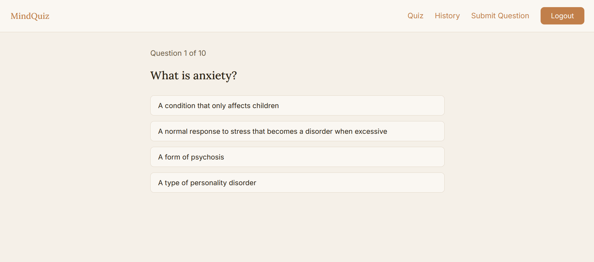

# 🧠 MindQuiz - Mental Health Literacy Platform

**ODS 3: Good Health and Well-being**
MindQuiz is an interactive platform designed to promote mental health literacy among young people. It provides an accessible way to recognize warning signs, understand anxiety, and learn how to act in crisis situations through gamified quizzes.

---

## 🚀 Live Demo
* **Frontend (Production):** [https://mental-health-quiz-nunazo987s.vercel.app](https://mental-health-quiz-nunazo987s.vercel.app)
* **Backend API:** https://mental-health-quiz.onrender.com

---

## 📸 Preview

---

## ✨ Features
* **User Authentication:** Secure Sign Up and Login powered by Supabase Auth.
* **Interactive Quiz:** Randomly generated 10-question sets to test mental health knowledge.
* **User History:** Authenticated users can track their past quiz scores and progress.
* **Community Contribution:** Users can submit new questions to the database.
* **Admin Moderation:** Dedicated panel for admins to review and approve pending questions.

---

## 🛠️ Tech Stack
| Layer | Technology | Deployment |
| :--- | :--- | :--- |
| **Frontend** | Angular 21+, TypeScript | Vercel |
| **Backend** | Node.js, Express | Render |
| **Database** | Supabase (PostgreSQL) | Supabase Cloud |
| **Auth** | Supabase Auth (JWT) | Supabase Cloud |
| **CI/CD** | GitHub Actions | GitHub Actions |

---

## ⚙️ Local Setup

1. **Clone the repository:**
   git clone <https://github.com/nunazo987/mental-health-quiz>

2. **Backend Setup:**
   cd backend
   npm install
   npm run dev
   (Required .env variables: SUPABASE_URL, SUPABASE_KEY, PORT)

3. **Frontend Setup:**
   cd frontend
   npm install
   ng serve

---

## 💡 Technical Decision
**CORS Policy Implementation:** A custom CORS middleware was implemented in the Express backend to restrict API access exclusively to the official Vercel production domain. This ensures data integrity and prevents unauthorized cross-origin requests, fulfilling the security requirements for production environments.

---

## 🧪 Testing
Run unit tests with:
npm test
(Project includes at least 3 passing unit tests covering core application components.)